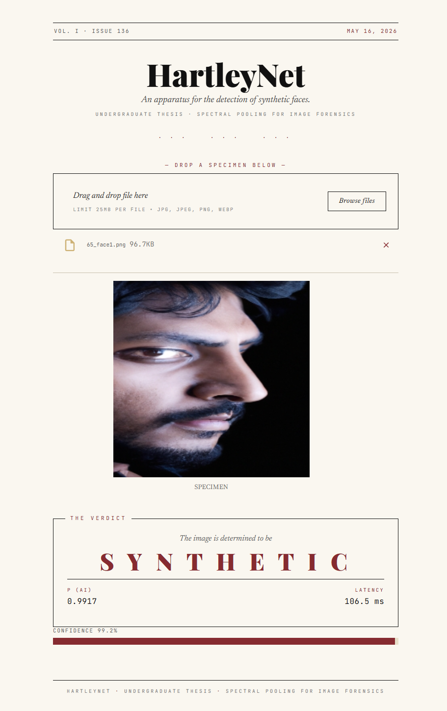
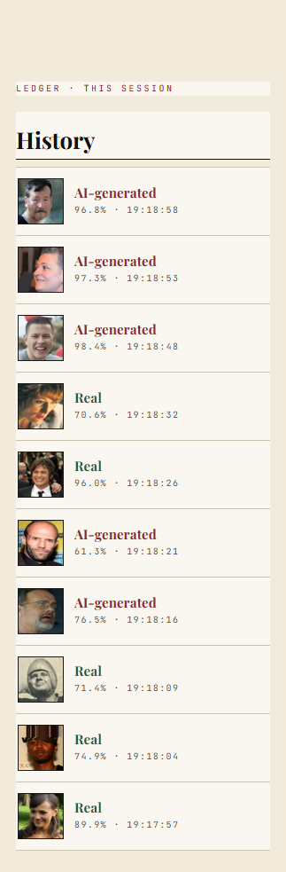

# HartleyNet — AI Image Detector

A Streamlit demo that wraps **HartleyNet**, the spectral-pooling image
forensics model from our undergraduate thesis. Drop in a face photo and
the app predicts whether it is AI-generated or real, with confidence and
inference latency.

> **Status:** Demo, May 2026. Trained on the thesis dataset
> (combined IMDB-Wiki real faces + several diffusion / GAN generators).
> Out-of-distribution images may behave unpredictably.

---

## What it does

- Drag-and-drop an image (`jpg` / `jpeg` / `png` / `webp`, up to 15 MB).
- The app preprocesses to 224×224, normalises with ImageNet statistics,
  and runs a single forward pass through HartleyNet.
- Output: predicted label (**AI-generated** or **Real**), raw probability
  to four decimal places, confidence bar, and the wall-clock inference
  time in milliseconds.
- A sidebar **History** ledger keeps the last 10 predictions of the
  session — thumbnail, label, confidence, timestamp.

## Screenshots

The verdict card after analysing an uploaded image:



The sidebar ledger tracking the last few predictions of the session:



## Run locally

Requires Python 3.10 – 3.12.

```bash
git clone https://github.com/<your-user>/HartleyNet.git
cd HartleyNet

python -m venv .venv
# Windows
.venv\Scripts\activate
# macOS / Linux
source .venv/bin/activate

pip install -r requirements.txt
streamlit run app.py
```

Streamlit will open the app at <http://localhost:8501>.

The `requirements.txt` pulls CPU-only PyTorch wheels via the
`--extra-index-url` line at the top of the file. If you have CUDA
available locally and want GPU inference, install `torch` /
`torchvision` from the appropriate CUDA index instead. The app
auto-detects CUDA and uses it when available.
<!--
## Deploy on Streamlit Community Cloud

1. Push this repository to GitHub (a public repo is fine; the model
   weights file is ~94 MB, under GitHub's 100 MB hard limit — GitHub
   will print a soft warning about the size).
2. Sign in to <https://share.streamlit.io> and click **New app**.
3. Point it at this repo, branch `main`, main file `app.py`.
4. Python version: 3.11 or 3.12 (set under *Advanced settings* if you
   want to pin it).
5. Deploy. The first build will take a few minutes — installing
   PyTorch + downloading the weights blob is the slow step. Subsequent
   reloads are fast thanks to `@st.cache_resource` on `load_model`.

The app uses the CPU torch wheels and stays within Community Cloud's
free-tier memory budget.
-->
## Project layout

```
.
├── app.py                  # Streamlit UI
├── model.py                # load_model + predict
├── utils.py                # preprocessing + history helpers
├── requirements.txt        # pinned deps (CPU torch)
├── .streamlit/config.toml  # base theme colours
├── hartleynet_arch/        # HartleyNet architecture package
│   ├── __init__.py
│   └── hartleynet.py       # spectral pooling + HartleyNet + builder
└── models/
    └── hartleynet.pth      # fine-tuned weights (94 MB)
```

## Model overview

HartleyNet is a ResNet-50 backbone modified for image forensics:

- The initial `max_pool` after the stem is replaced with a **Hartley
  spectral pooling** layer (`HartleyPool2d`), which downsamples in the
  frequency domain via the Discrete Hartley Transform rather than via
  spatial max-pooling. This preserves frequency-band information that
  generative models often distort.
- Inside each bottleneck (`HartleyBottleneck`) the stride-2 `3×3`
  convolution is replaced with a stride-1 conv followed by another
  spectral pool. The skip connection is downsampled with a matching
  spectral pool so the residual addition aligns.
- Backbone is warm-started from ImageNet weights at training time;
  the spectral pool and final FC head are randomly initialised and
  fine-tuned end-to-end with **sigmoid focal loss** (α=0.8, γ=3.0).
- Head is a single logit. `sigmoid(logit)` is the probability that the
  image is AI-generated. The decision threshold for label assignment in
  this demo is fixed at **0.5**.
- Input is 3-channel RGB at **224×224**, normalised with the ImageNet
  mean/std (`[0.485, 0.456, 0.406]` / `[0.229, 0.224, 0.225]`).

## Attribution

The spectral pooling primitives (`HartleyPool2d`, the Discrete Hartley
Transform helpers, the cropping/padding utilities, and the autograd
`SpectralPoolingFunction`) are adapted from the reference implementation
by Zhang et al., *"Hartley Spectral Pooling for Deep Learning"* —
<https://github.com/AlbertZhangHIT/HartleySpectralPooling>. They are
inlined into `hartleynet_arch/hartleynet.py` so this demo is
self-contained.

## License

This demo is shared for academic and review purposes. The HartleyNet
weights are derivative of the thesis dataset and not re-licensed for
downstream training or redistribution; please reach out before reusing.
